# 개발 안내

## 도구와 타입 경로

이 패키지는 `package.json`의 `packageManager`에 선언된 `bun@1.3.14`를 사용합니다. Pi 타입은 devDependency `@earendil-works/pi-coding-agent`의 `node_modules` 설치본에서 해석됩니다. 해당 개발 의존성 범위는 `^0.82.0`이고 현재 `bun.lock` 해석 버전은 `0.82.1`입니다. 반면 optional peer dependency는 `*`이므로 소비자의 Pi 최소 버전을 메타데이터로 강제하지 않습니다.

```bash
bun install
bun run check
bun run test
bun run ci
bun pm pack --dry-run
```

`ci`는 warning을 오류로 처리하는 Biome lint, 타입 검사, 테스트를 순서대로 실행합니다. `pack --dry-run`은 배포하지 않고 패키지 포함 파일을 확인합니다.

## 프로젝트 구조



이 이미지는 구조 개요이며, 아래의 세부 파일 구성을 대체하지 않습니다. Mermaid 원본: [`diagram/architecture.mmd`](diagram/architecture.mmd)

```text
index.ts                  — 안정적인 Pi 확장 진입점, package.json의 pi.extensions가 참조
src/client.ts             — capability-gated V2와 설정-gated V1 cmux 쓰기, resume ownership 확인
src/config.ts             — public 환경 변수, 기본값, 범위
src/events.ts             — shared presence의 fixed local projection과 presentation-only registry
src/hooks.ts              — Pi lifecycle과 shared presence observer 등록
src/identity.ts           — workspace/surface UUID와 안전한 소켓 경로 검증
src/notification-policy.ts — exact `subagent` 누적 terminal·attention/flash policy 판정
src/official-hook.ts      — home-relative agent directory의 bounded regular-file read와 공식 cmux hook authority 감지
src/presence.ts           — 설정을 해석하고 runtime과 hook adapter를 조합하는 얇은 composition root
src/presentation.ts       — status/progress 선택, style, label·meta·terminal 상태와 exact interaction waiting의 fixed/private 표시를 위한 순수 렌더링 정책
src/protocol.ts           — 목적지별 byte 한도와 cmux V1/V2 request·response 검증·인코딩
src/runtime.ts            — shared presence consumer/producer와 terminal projection, 세션 상태 머신, deadline-bounded 경로 검증, 직렬 teardown과 opt-in 조정
src/text.ts               — control/bidi 정규화와 code-point-safe UTF-8 byte 축약
src/todo.ts               — provenance와 전체 task ID 고유성을 확인한 RPIV todo count/progress adapter
src/transport.ts          — intrinsic safeSocketFingerprint와 lease gate, deadline/abort-fenced 소켓 재검증·post-connect pending response gate, 단일 직렬 queue, keyed latest-write-wins 병합
src/usage.ts              — assistant message별 usage delta의 토큰·비용 누적과 context 사용률 집계
src/validation.ts         — untrusted input의 plain-object·control/bidi·protocol token 공통 검증
test/client.test.ts       — PresenceClient의 capability-gated V2/V1 쓰기와 resume ownership 테스트
test/config.test.ts       — 환경 변수 기본값과 허용 범위 파싱 테스트(`settled` trim/case 포함)
test/entrypoint.test.ts   — 공개 확장 진입점의 V2 listener/hook 등록과 실제 producer→bus→consumer lifecycle 테스트
test/notification-policy.test.ts — exact `subagent` cumulative terminal 판정, `settled` policy matrix, notification/flash policy, 고정 deadline 산술 테스트
test/runtime-notification-acceptance.test.ts — 실제 V2 producer→bus→consumer와 fake Unix socket으로 terminal exactly-once, withdrawal, retained-quiet, source failover와 notification/presentation 경계를 검증
test/protocol.test.ts     — V1/V2 codec 인코딩·디코딩과 byte 한도 테스트
test/official-hook.test.ts — marker/부재/override와 non-regular·64 KiB 초과 source의 bounded probe 테스트
test/runtime-resolution.test.ts — startup resolver, 공식 hook probe deadline·epoch fence, runtime 공유 fingerprint lease gate의 replacement fence 테스트
test/socket-only.test.ts  — production 소스에 process 실행 API가 없음을 확인하는 정적 가드 테스트
test/state.test.ts        — shared V2 fence/terminal projection, todo adapter, identity, usage 상태 테스트
test/text.test.ts         — canonical local turn 및 exact interaction waiting fixed/private presentation, text 정규화·축약과 byte-bound 테스트
test/transport.test.ts    — UnixSocketTransport 연결 lifecycle과 BoundedSocketQueue 테스트
test/helpers/             — 테스트 전용 in-memory fake Unix 소켓 서버(`fake-socket.ts`)
docs/                     — 주제별 문서
docs/diagram/             — Mermaid 원본, 흰색 배경 SVG·2x PNG 렌더 결과, 공유 mermaid-config.json·puppeteer-config.json
docs/guidelines/          — 벤더된 문서·에이전트 지침 작성 가이드(`a-complete-guide-to-agents-md.md`, `karpathy-guidelines.md`)
```

루트 `index.ts`는 그대로 둡니다. `package.json`의 `pi.extensions`가 이 파일을 확장 진입점으로 참조하기 때문입니다. `src/`는 하위 디렉터리 없이 평면 구조이며, composition root인 `src/presence.ts`를 제외한 각 모듈이 설정·identity·transport·protocol·client·hooks·runtime·notification policy·presentation·text·usage·events·todo·validation·official-hook 중 하나의 단일 책임만 갖습니다. `test/`는 대체로 같은 이름의 `src` 모듈을 다루지만, `socket-only.test.ts`처럼 여러 모듈에 걸친 정적 불변 조건을 확인하는 테스트도 있고 `test/helpers/`는 공유 fake 소켓 fixture만 둡니다.

## 다이어그램 렌더링

Mermaid 원본과 렌더링 결과(흰색 배경 SVG, 흰색 배경 2x PNG)는 `docs/diagram/`에 함께 둡니다. 같은 디렉터리의 공유 `mermaid-config.json`과 `puppeteer-config.json`이 테마와 sandbox 플래그를 결정합니다.

```bash
bun run diagram:render
```

정확한 입력·출력 파일 목록과 옵션은 `package.json`의 script와 [`docs/diagram/README.md`](diagram/README.md)를 기준으로 합니다.

## 변경 불변 조건

- cmux CLI나 다른 프로세스를 실행하지 않고 Unix 소켓만 사용합니다.
- 유효한 `CMUX_WORKSPACE_ID`/`CMUX_SURFACE_ID`와 안전한 소켓이 없으면 대상·포커스를 추측하지 않습니다.
- V2 선택 메서드는 `system.capabilities`가 광고한 정확한 메서드만 호출합니다. V1 응답은 정확히 `OK`여야 합니다.
- observer 오류와 잘못된 host session ID는 Pi 작업 실패가 아니라 해당 presence 비활성화 또는 출력 유실로 끝나야 합니다.
- progress가 비활성일 때는 초기화·종료 cleanup도 보내지 않습니다. 활성화된 progress는 workspace 전역 슬롯이므로 session teardown과 startup을 직렬화합니다. startup 소켓 경로 검증은 client ownership 전에 request timeout으로 제한하고 session epoch abort와 race하므로 replacement/shutdown이 느린 filesystem 작업을 기다리지 않습니다. deadline/abort 후에도 남은 resolver는 settle 전까지 독점되어 다음 epoch가 새 filesystem 검증을 시작할 수 없고, stale 결과는 재사용하지 않습니다. transport는 실제 post-connect fingerprint가 미해결인 동안의 request write 전 data/end/close/error만 response로 수락하지 않고 즉시 fail-close합니다. runtime-owned fingerprint lease gate는 replacement를 포함한 모든 runtime transport에서 미해결 filesystem validation 하나만 허용하며 stale lease가 settle될 때까지 새 validation을 거부하지만, transport는 항상 module-intrinsic `safeSocketFingerprint`를 직접 실행합니다. standalone transport도 자체 gate를 만들어 같은 보장을 유지합니다. 연결 전 connect error/timeout과 post-write 응답 timeout은 현재 요청만 실패시키고 queue를 close하지 않습니다. capability probe와 owned-progress 초기화 중 생성된 client도 즉시 runtime ownership에 등록해 replacement/shutdown이 같은 제한된 teardown barrier에서 close·await해야 합니다. owned-progress 초기화는 그 ownership이 확립된 뒤에만 실행합니다.
- 전송 text를 추가하면 `src/protocol.ts`의 목적지별 UTF-8 byte 한도와 `src/text.ts`의 Unicode-safe 축약을 함께 적용합니다.
- status key는 surface를 포함해 해시하고 `set_status`는 해당 surface panel에 범위 지정합니다. 새 local presentation을 추가하면 style·priority와 privacy/byte-bound 테스트를 함께 갱신합니다.
- shared presence protocol, lifecycle, terminal batching은 고정 tag의 [Protocol](https://github.com/spi-ca/pi-presence/blob/v2-20260818-2/docs/protocol.md), [Lifecycle](https://github.com/spi-ca/pi-presence/blob/v2-20260818-2/docs/lifecycle.md), [Terminal batches](https://github.com/spi-ca/pi-presence/blob/v2-20260818-2/docs/terminal-batch.md)를 기준으로 합니다. 이 저장소는 shared protocol을 복제하지 않으며 cmux projection과 local presentation policy만 변경합니다. subagent completion에는 그 policy의 누적 attention만 적용합니다.
- todo adapter는 descriptive task text나 tool result text를 보관·전송하지 않습니다. provenance와 deleted-task 제외 규칙을 약화하지 않습니다.
- `UsageTracker`에는 각 assistant message의 usage를 그 message의 delta로만 전달합니다. `add()`는 message별 토큰·비용 delta를 더하므로 누적 total을 반복 전달하면 안 됩니다.
- 공식 cmux hook probe는 소켓 경로 해석 전에 `timeoutMs` deadline 및 session epoch abort로 제한합니다. probe timeout·abort·오류와 non-regular 또는 64 KiB 초과 source는 authority가 불확실하므로 공식 hook이 있다고 fail-close하며, 실제로 미해결인 underlying probe는 runtime당 하나만 허용하고 늦은 결과를 새 epoch에 적용하지 않습니다. marker가 없는 정상 regular source와 확인된 부재, 정확한 `CMUX_PI_HOOKS_DISABLED=1`만 hook 부재로 처리합니다. 공식 hook이 감지되거나 authority가 불확실하면 이 패키지는 native lifecycle/opt-in hook 대체 기능을 보내지 않습니다. buffered `pi-subagent` success의 native notification/flash도 억제하되, 집계 error는 policy·capability가 허용하면 한 번 보낼 수 있습니다. precedence를 무시하는 중복 출력을 추가하지 않습니다.
- 검토한 child profile은 정확한 `PI_CMUX_PROFILE=subagent-child-v1`와 channel별 exact disable만 해석합니다. partial·malformed `PI_CMUX_*` 값이나 `PI_CMUX_SIDEBAR_SOURCE`로 다른 suppression을 추론하지 않고, sidebar/status·progress·log를 끄지 않습니다.
- local Pi 및 `subagent` terminal의 `cancelled` outcome은 status-only입니다. `all`/`attention` policy에서도 notification·flash·attention log로 승격하지 않습니다.
- local Pi sidebar/notification은 canonical fixed summary만 사용합니다. assistant response body·preview, prompt, raw error, path, tool argument/output을 새 전송 text로 추가하지 않으며 terminal sidebar는 `finalClearMs` 뒤 clear합니다. notification 보존과 focused-banner suppression은 cmux 소유입니다.
- input-required의 고정 `Pi needs your input` 표시는 shared contract가 유효한 해당 input state에만 적용합니다. label·prompt 등 producer payload를 새 cmux text에 넣지 않습니다. 새 attention만 기존 gate를 따르고 retained 표시 갱신은 status-only입니다. 이 표시를 모든 Pi input wait의 감지나 producer lifecycle/실행/취소 authority로 확장하지 않습니다.
- feed, meta block, auto-title, resume fallback은 opt-in 데이터 경로입니다. feed의 detached startup queue만 32 edge로 bounded하며 overflow는 그 epoch의 feed를 fail-close해 출력하지 않습니다. readiness는 snapshot을 한 JavaScript turn 안에 client의 bounded socket queue로 순서 제출하고 local queue를 끝내며, 이후 edge는 local buffering 없이 client queue로 직접 보냅니다. generic presence update나 `pi-subagent` producer를 추가해도 이 기능이나 live cmux mutation/focus 제어를 암묵적으로 활성화하지 않습니다. 새 필드나 메서드는 protocol allowlist와 개인정보 문서를 함께 검토합니다.

## 검증 범위

`bun run ci`는 설정 파싱, V1/V2 cmux codec과 multibyte 경계, capability gate, shared presence의 cmux projection·clear·presentation policy, exact `subagent` cumulative terminal·notification/flash policy와 고정 deadline 산술, privacy byte bound, todo ID 고유성, invalid session fail-closed, 공식 hook precedence, socket 검증·timeout·queue 복구, runtime replacement·teardown race와 keyed queue 병합을 실행합니다. `test/runtime-notification-acceptance.test.ts`는 manual clock과 fake Unix socket으로 terminal aggregation, fixed/private socket text, notification/flash capability 독립성, aggregate privacy canary, replacement/shutdown callback fence와 notification RPC failure 격리를 추가로 확인합니다. `bun pm pack --dry-run`은 패키징 범위를 확인합니다.

이 검증은 consumer 쪽 cmux projection·presentation policy, 검토한 exact child-profile suppression, fake Unix socket과 정적 status-key namespace까지만 다룹니다. 실행 중인 `pi-subagent` 또는 `pi-cmux`, 두 package의 load order, root aggregate/child `inherit` 공존, cmux 서버와의 live 연동은 검증하지 않습니다. 따라서 실제 cmux 서버의 버전·capability·hook 동작과 live 호환성은 자동 테스트가 보장하지 않습니다. 변경 후 실제 환경에서 확인할 항목은 UUID/소켓 안전성, capability advertisement, 공식 hook precedence, 필요한 opt-in flag입니다.

## 관련 문서

- [`configuration.md`](configuration.md) — 환경 변수, capability negotiation, socket/identity 조건과 opt-in 개인정보 범위
- [`event-contract.md`](event-contract.md) — shared presence의 cmux projection, presentation과 authority 경계
- [`feature-ownership.md`](feature-ownership.md) — `pi-cmux-presence`/`pi-subagent`/공식 cmux hook의 기능 경계와 `pi-cmux` 비교표
- [`pi-subagent-integration.md`](pi-subagent-integration.md) — `pi-subagent` V2 producer 연동 계약과 lifecycle authority 경계

## 문서 작성 방식

`docs/guidelines/`의 progressive disclosure 접근을 따릅니다.

- `README.md`는 짧고 신호가 높은 진입 문서로 유지합니다.
- 자세한 동작은 위 주제별 문서에 둡니다.
- 전체 구현 목록보다 안정적인 개념을 우선합니다.
- 예외를 추가하기보다 모순을 제거합니다.
- 중복된 명령 목록은 최소화하고 `package.json`과 맞춥니다.
