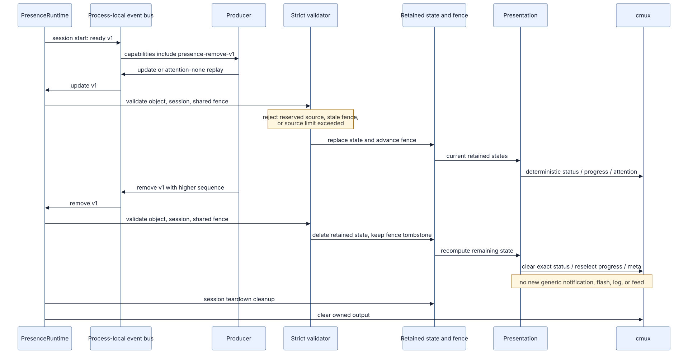

# Shared presence의 cmux projection

`pi-cmux-presence`는 shared presence를 cmux 상태·progress·notification·flash로
**투영**하는 consumer입니다. wire protocol, DTO, consumer activation, retained-state
lifecycle과 terminal batching을 구현하거나 해석하는 권위는 공유 의존성에 있습니다.

이 이미지는 cmux consumer의 흐름 개요입니다. Mermaid 원본: [`diagram/event-flow.mmd`](diagram/event-flow.mmd)

## 불변 canonical contract

이 패키지가 고정한 의존성 tag의 문서가 shared presence 계약의 유일한 기준입니다.

- [Protocol](https://github.com/spi-ca/pi-presence/blob/v2-20260818-2/docs/protocol.md) — 채널과 strict DTO
- [Lifecycle](https://github.com/spi-ca/pi-presence/blob/v2-20260818-2/docs/lifecycle.md) — producer/consumer activation과 retained state
- [Terminal batches](https://github.com/spi-ca/pi-presence/blob/v2-20260818-2/docs/terminal-batch.md) — live terminal batching

공유 protocol의 parser, registry, receipt, replay, source occupancy와 ordering fence는
이 저장소의 cmux 정책이 아닙니다. 해당 의미를 바꾸는 변경은 이 consumer가 아니라
위 canonical 문서와 `@pi/presence`에서 검토합니다.

## cmux projection과 개인정보 경계

수락된 shared presence는 producer가 보낸 label이나 task 내용을 재사용하지 않고
고정된 local vocabulary와 숫자 집계로 렌더링됩니다. Pi, todo, subagent, input
표시는 각각 cmux presentation의 역할 이름일 뿐 외부 producer를 식별하거나 제어하는
권한이 아닙니다.

- assistant response, prompt, raw error, 경로, tool 인수·출력, task text, run ID와
  session ID는 cmux로 복사하지 않습니다.
- input-required projection은 고정 문구 `Pi needs your input`만 사용합니다. 새
  attention만 기존 notification/flash policy를 거치며 retained 표시 갱신은 quiet합니다.
- subagent completion은 이 consumer의 누적 attention 정책으로 한 번의 cmux alert로
  의미 있게 묶을 수 있습니다. cancellation은 status-only이며 notification·flash·log로
  승격하지 않습니다.
- withdrawal로 표시된 retained projection이 사라지면 해당 status를 clear하고 남은
  projection으로 progress와 opt-in meta block을 다시 계산합니다. 이 동작은 새 alert나
  feed를 만들지 않습니다.

## authority와 실패 격리

이 extension은 Unix socket으로 cmux를 관찰·표시할 뿐 producer의 실행, cancellation,
result collection, lease, cleanup, focus 또는 target lifecycle을 소유하지 않습니다.
공식 cmux hook이 우선하면 이 consumer의 local lifecycle 및 opt-in fallback 출력도
억제합니다.

공유 event 수락 거부, listener 오류, capability 부재, socket 오류·시간 초과·큐 포화는
observer 출력만 잃게 할 수 있고 Pi 또는 producer 작업을 실패시키지 않습니다. cmux
명령과 socket 안전 조건은 [configuration](configuration.md)을, policy의 정확한 gate는
[configuration](configuration.md#attention-정책과-레거시-flag)을 참고하세요.
